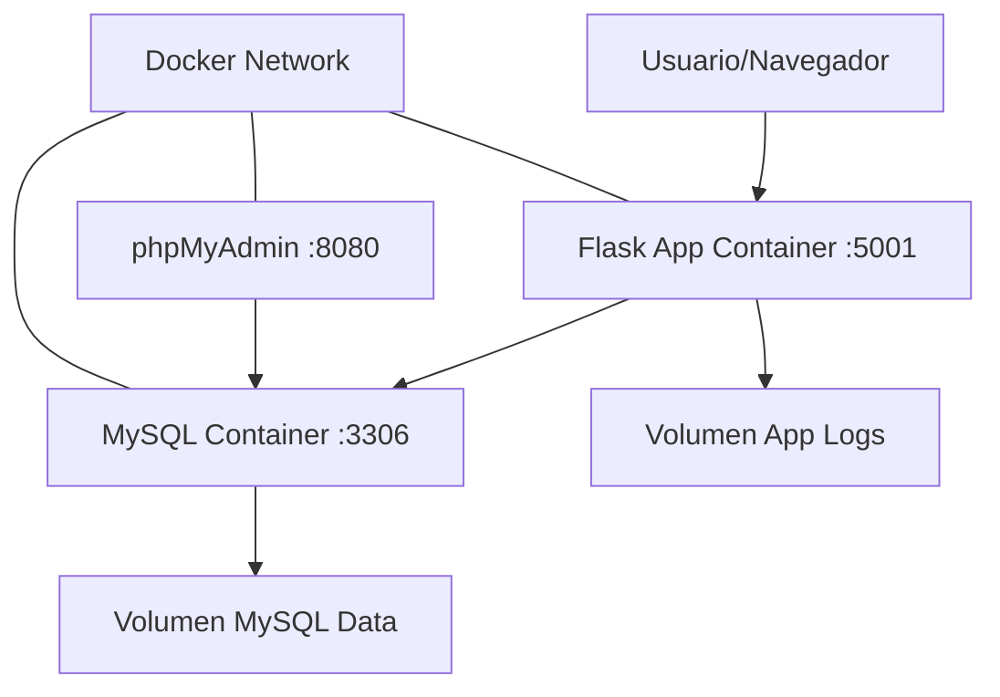

# 🐳 **Sistema Cafés Marloy - Dockerización Completa**

Este documento explica cómo funciona la dockerización del Sistema Cafés Marloy y cómo utilizarla.

---

## 📋 **Tabla de Contenidos**

- [🎯 Qué es la Dockerización](#-qué-es-la-dockerización)
- [🏗️ Arquitectura del Sistema](#️-arquitectura-del-sistema)
- [📦 Componentes](#-componentes)
- [🚀 Inicio Rápido](#-inicio-rápido)
- [⚙️ Configuración Avanzada](#️-configuración-avanzada)
- [🔧 Comandos Útiles](#-comandos-útiles)
- [🐛 Solución de Problemas](#-solución-de-problemas)

---

## 🎯 **Qué es la Dockerización**

La dockerización permite ejecutar el Sistema Cafés Marloy en **contenedores aislados**, lo que proporciona:

✅ **Portabilidad**: Funciona igual en cualquier sistema que tenga Docker  
✅ **Consistencia**: Mismo entorno en desarrollo, testing y producción  
✅ **Aislamiento**: No afecta tu sistema ni otras aplicaciones  
✅ **Escalabilidad**: Fácil de escalar y gestionar  
✅ **Simplicidad**: Un comando para levantar todo el sistema

---

## 🏗️ **Arquitectura del Sistema**



### **Servicios Incluidos:**

1. **🌐 Flask Application** (`flask_app`)

   - Puerto: `5001`
   - Aplicación web principal
   - Validaciones robustas implementadas

2. **🗄️ MySQL Database** (`mysql_db`)

   - Puerto: `3306`
   - Base de datos con datos de ejemplo
   - Configuración optimizada

3. **🔧 phpMyAdmin** (`phpmyadmin`)
   - Puerto: `8080`
   - Interfaz web para administrar MySQL

---

## 📦 **Componentes**

### **Archivos de Configuración:**

```
Obligatorio_BD/
├── docker-compose.yml          # 🎼 Orquestación de servicios
├── docker-start.sh            # 🚀 Script de inicio
├── docker-stop.sh             # 🛑 Script de parada
├── backend-flask-simple/
│   ├── Dockerfile             # 🐳 Imagen de la aplicación
│   ├── requirements.txt       # 📦 Dependencias Python
│   └── .dockerignore         # 🚫 Archivos a excluir
└── docker/
    └── mysql/
        ├── init/              # 📊 Scripts de inicialización
        │   └── 01-init-database.sql
        └── conf/              # ⚙️ Configuración MySQL
            └── mysql.cnf
```

### **Volúmenes Persistentes:**

- **`cafes_marloy_mysql_data`**: Datos de la base de datos
- **`cafes_marloy_app_logs`**: Logs de la aplicación

### **Red de Docker:**

- **`cafes_marloy_network`**: Red privada para comunicación entre contenedores

---

## 🚀 **Inicio Rápido**

### **Prerrequisitos:**

```bash
# Verificar que Docker esté instalado
docker --version

# Verificar Docker Compose
docker-compose --version
# O en versiones nuevas:
docker compose version
```

### **Iniciando el Sistema:**

```bash
# Método 1: Usar el script automático (RECOMENDADO)
./docker-start.sh

# Método 2: Comandos manuales
docker-compose down --remove-orphans
docker-compose build --no-cache
docker-compose up -d
```

### **Accesos:**

| Servicio           | URL                   | Credenciales                     |
| ------------------ | --------------------- | -------------------------------- |
| **Aplicación Web** | http://localhost:5001 | admin@cafesmarloy.com / admin123 |
| **phpMyAdmin**     | http://localhost:8080 | root / rootroot                  |
| **MySQL Directo**  | localhost:3306        | flask_user / flask_password      |

---

## ⚙️ **Configuración Avanzada**

### **Variables de Entorno en docker-compose.yml:**

```yaml
# Base de datos
MYSQL_ROOT_PASSWORD: rootroot
MYSQL_DATABASE: cafes_marloy
MYSQL_USER: flask_user
MYSQL_PASSWORD: flask_password

# Aplicación Flask
FLASK_ENV: production
DB_HOST: mysql_db
HOST: 0.0.0.0
PORT: 5001
```

### **Puertos Personalizados:**

Para cambiar puertos, edita `docker-compose.yml`:

```yaml
ports:
  - "5002:5001" # Cambiar puerto de la app a 5002
  - "3307:3306" # Cambiar puerto de MySQL a 3307
  - "8081:80" # Cambiar puerto de phpMyAdmin a 8081
```

### **Configuración de MySQL:**

El archivo `docker/mysql/conf/mysql.cnf` contiene optimizaciones:

- ✅ UTF-8 completo (utf8mb4)
- ✅ Configuración de memoria optimizada
- ✅ Logging de queries lentas
- ✅ Configuración de seguridad

---

## 🔧 **Comandos Útiles**

### **Gestión de Servicios:**

```bash
# Ver estado de contenedores
docker-compose ps

# Ver logs en tiempo real
docker-compose logs -f

# Ver logs de un servicio específico
docker-compose logs -f flask_app
docker-compose logs -f mysql_db

# Reiniciar un servicio
docker-compose restart flask_app

# Detener todo
./docker-stop.sh
```

### **Desarrollo y Debug:**

```bash
# Ejecutar comandos dentro del contenedor de la app
docker-compose exec flask_app bash

# Conectar a MySQL desde línea de comandos
docker-compose exec mysql_db mysql -u root -p cafes_marloy

# Ver variables de entorno del contenedor
docker-compose exec flask_app env

# Reconstruir solo la aplicación
docker-compose build flask_app --no-cache
```

### **Gestión de Datos:**

```bash
# Backup de la base de datos
docker-compose exec mysql_db mysqldump -u root -prootroot cafes_marloy > backup.sql

# Restaurar backup
docker-compose exec -T mysql_db mysql -u root -prootroot cafes_marloy < backup.sql

# Limpiar volúmenes (CUIDADO: borra todos los datos)
docker-compose down -v
```

---

## 🐛 **Solución de Problemas**

### **❌ Error: Puerto en uso**

```bash
# Verificar qué proceso usa el puerto
lsof -i :5001
# O en Linux:
netstat -tulpn | grep 5001

# Cambiar puerto en docker-compose.yml o detener el proceso
```

### **❌ Error: No se puede conectar a MySQL**

```bash
# Verificar que MySQL esté listo
docker-compose logs mysql_db

# Reiniciar servicio de MySQL
docker-compose restart mysql_db

# Verificar conexión
docker-compose exec mysql_db mysql -u root -prootroot -e "SHOW DATABASES;"
```

### **❌ Error: La aplicación no inicia**

```bash
# Ver logs detallados
docker-compose logs flask_app

# Verificar variables de entorno
docker-compose exec flask_app env | grep DB_

# Reconstruir imagen
docker-compose build flask_app --no-cache
```

### **❌ Problemas de permisos (Linux/macOS)**

```bash
# Hacer scripts ejecutables
chmod +x docker-start.sh docker-stop.sh

# Agregar usuario al grupo docker (Linux)
sudo usermod -aG docker $USER
# Luego cerrar sesión y volver a entrar
```

### **❌ Limpiar todo el sistema Docker**

```bash
# CUIDADO: Esto elimina TODOS los contenedores y volúmenes
docker system prune -a --volumes
```

---

## 🔒 **Consideraciones de Seguridad**

### **Para Desarrollo:**

- ✅ Contraseñas simples están bien
- ✅ Puertos expuestos para acceso fácil

### **Para Producción:**

- 🔐 Cambiar todas las contraseñas
- 🔐 Usar variables de entorno externas
- 🔐 Configurar HTTPS/SSL
- 🔐 Limitar puertos expuestos
- 🔐 Usar secrets de Docker

---

## 📈 **Monitoreo y Logs**

### **Health Checks:**

Los contenedores incluyen health checks automáticos:

```bash
# Ver estado de salud
docker-compose ps

# Logs de health check
docker inspect cafes_marloy_app | grep -A5 Health
```

### **Logs Centralizados:**

```bash
# Todos los logs juntos
docker-compose logs -f

# Solo errores
docker-compose logs -f | grep -i error

# Logs con timestamps
docker-compose logs -f -t
```

---

## 🎉 **Ventajas de esta Implementación**

✅ **Inicio con un comando**: `./docker-start.sh`  
✅ **Persistencia de datos**: Los datos se mantienen entre reinicios  
✅ **Fácil desarrollo**: Volúmenes montados para desarrollo  
✅ **Administración visual**: phpMyAdmin incluido  
✅ **Configuración optimizada**: MySQL configurado para rendimiento  
✅ **Seguridad básica**: Usuario no-root en contenedores  
✅ **Scripts útiles**: Automatización de tareas comunes  
✅ **Documentación completa**: Todo explicado paso a paso

---

## 📞 **Soporte**

Si tienes problemas:

1. **Verifica los logs**: `docker-compose logs -f`
2. **Consulta esta documentación**
3. **Revisa el estado**: `docker-compose ps`
4. **Prueba reiniciar**: `./docker-stop.sh && ./docker-start.sh`

---

**🎯 ¡Sistema Cafés Marloy dockerizado y listo para usar!** 🎯
